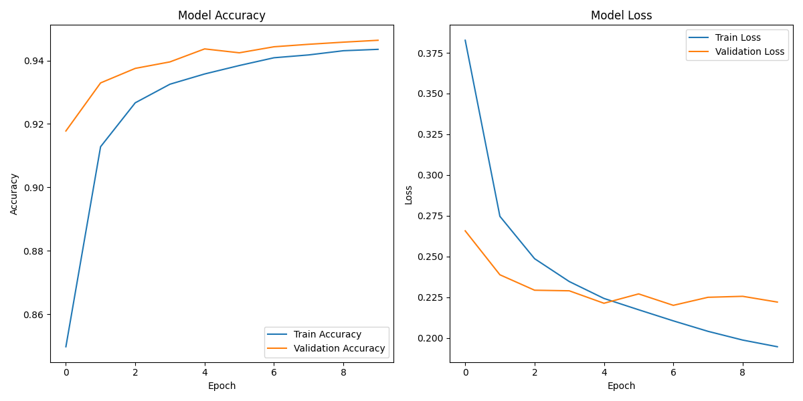

# Fake News Detection Using Deep Learning on the CIC Truth Seeker Dataset 2023  

## Overview  
This project explores the use of deep learning models to detect fake news on social media platforms, specifically using the **CIC Truth Seeker Dataset 2023**. The dataset comprises over **120,000 tweets** from users of X (formerly Twitter), reflecting opinions on **700 true news stories and 700 false news stories**. The false news classification was determined by **456 experts** via Amazon Mechanical Turk.

The primary challenge of fake news detection on social media is the **short length of posts**, which often lack sufficient semantic information. This project aims to overcome this limitation by leveraging **advanced preprocessing techniques, word embeddings, and hyperparameter optimization**.

## Models Trained  
We trained and evaluated three deep learning architectures:  

1. **Long Short-Term Memory (LSTM)** – A recurrent neural network that captures long-term dependencies in text sequences.  
2. **Convolutional Neural Network (CNN)** – A unidirectional CNN that identifies local patterns in text.  
3. **Hybrid CNN-LSTM** – A combination of CNN and LSTM to extract both spatial and sequential dependencies.  

## Methodology  
### 1. Data Preprocessing  
- Tokenization and text cleaning  
- Removal of stopwords, special characters, and redundant symbols  
- Word embedding representation using pre-trained word vectors  

### 2. Model Training  
- **Optimization**: Hyperparameters were optimized using **HyperOpt**  
- **Evaluation Metrics**: Accuracy, Precision, Recall, F1-score  

## Results  
The **LSTM model** outperformed the others, achieving:  

- **Accuracy:** 94.64%  
- **Precision:** 94%  
- **Recall:** 95%  
- **F1-score:** 95%  

These results demonstrate the effectiveness of deep learning techniques in **classifying fake news**, even when dealing with short-length text.  

## Visualizations  

### LSTM accuracy and loss plot
  

## Conclusion  
This research contributes to the **growing field of automated fake news detection** by demonstrating the effectiveness of LSTMs, CNNs, and hybrid models in classifying short social media posts. The findings highlight the importance of **advanced preprocessing, word embeddings, and hyperparameter tuning** in improving classification accuracy.  
